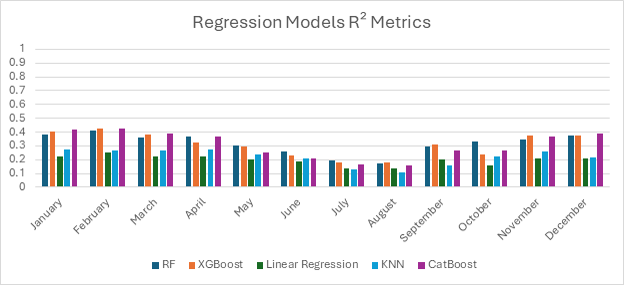
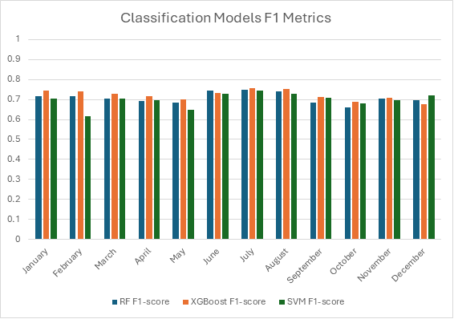
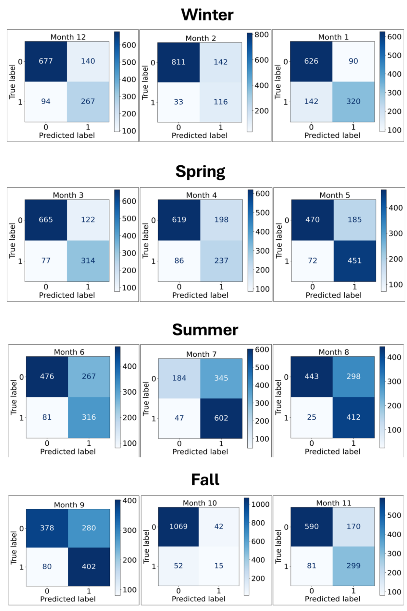

# Predictive Modeling of Precipitation in South Carolina

## Overview

This project investigates daily precipitation prediction in South Carolina using historical NOAA climate data collected between 2000 and 2023. Multiple machine learning algorithms were evaluated to compare regression and binary classification approaches.

The project demonstrates an end-to-end machine learning workflow, including data preparation, feature engineering, model development, hyperparameter tuning, model evaluation, and final prediction on unseen 2024 data.

---

## Skills Demonstrated

- Python
- Machine Learning
- Data Cleaning & Preprocessing
- Feature Engineering
- Time-Series Cross Validation
- Hyperparameter Tuning
- Model Evaluation
- Data Visualization

---

## Technologies

- Python 3.10
- Jupyter Notebook
- pandas
- NumPy
- matplotlib
- scikit-learn
- XGBoost
- CatBoost

---

## Project Structure

```
notebooks/
├── 01_Data_Preparation.ipynb
├── 02_Regression_Models.ipynb
└── 03_Classification_Models.ipynb

images/
├── regression_model_comparison.png
├── classification_model_comparison.png
└── monthly_confusion_matrices.png
```

---

## Results

### Regression Model Performance

XGBoost and CatBoost consistently produced the strongest regression performance, with Random Forest also performing well. Regression models were ultimately limited by the highly nonlinear nature of daily precipitation.



---

### Classification Model Performance

Reframing precipitation prediction as a binary classification problem substantially improved predictive performance. The tuned XGBoost classifier achieved the highest F1 scores across most months.



---

### Final Model Evaluation

The final tuned XGBoost classifier was trained using historical climate data and evaluated on unseen 2024 observations. Monthly confusion matrices summarize prediction performance throughout the year.



---

## Key Findings

- Compared five regression algorithms and three classification algorithms.
- Implemented walk-forward time-series validation to avoid data leakage.
- Hyperparameter tuning improved model performance.
- Reformulating the problem as binary classification substantially improved predictive accuracy.
- XGBoost produced the strongest overall predictive performance.

---

## Thesis

The complete thesis describing the methodology, experiments, and findings is available on [ProQuest](https://www.proquest.com/dissertations-theses/predictive-modeling-precipitation-changes-south/docview/3290665231/se-2?accountid=55037)
